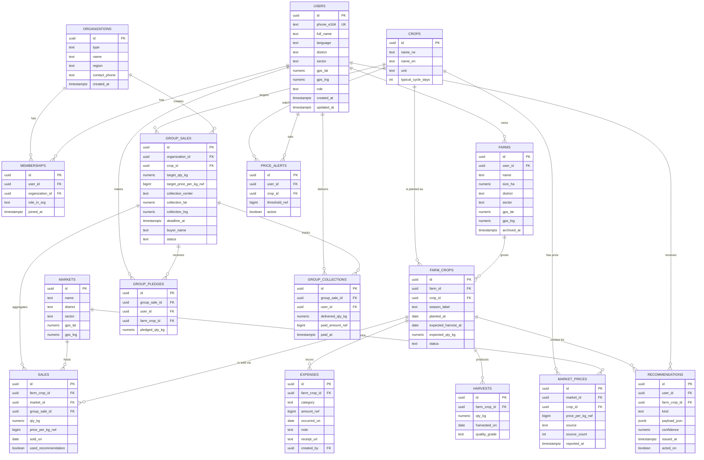

# FPIS — Database ERD & Frontend/Backend Data Contract

This document is the **single source of truth** for the FPIS data model. Frontend and backend MUST agree on the names, types, and relationships defined here. Any change requires PO sign-off and a version bump at the bottom of this page.

**Version:** 1.0 — May 2026
**Owner:** PO + Backend Developer
**Audience:** Backend, Frontend, Data Analyst, AI Developer

---

## How to use this document

- **Backend**: implement migrations and APIs to match the schema below exactly. Type, name, and nullability must match.
- **Frontend**: type your TypeScript models from the entity reference. Don't invent fields.
- **Data Analyst**: seed data must conform to the same column types and FK constraints.
- **AI / PO**: the recommendation engine reads from this schema; new signals require a schema update PR.

---

## ERD Diagram

The diagram below renders directly inside Notion as a Mermaid block. Copy the code block into a `/code` block with language `mermaid`, or import this `.md` file into Notion and the block will render automatically.



---

## Entity Reference

Each entity below lists every column with type, nullability, and notes. Frontend TypeScript models should be a 1:1 reflection of these tables.

### users

| Column | Type | Null | Notes |
|---|---|---|---|
| id | uuid | NO | UUIDv7. Primary key. |
| phone_e164 | text | NO | Unique. Login identifier (E.164 format, e.g. +250788123456). |
| full_name | text | YES | Set during onboarding. |
| language | text | NO | Default `rw`. Allowed: `rw`, `en`, `fr`. |
| district | text | YES | Rwanda administrative district. |
| sector | text | YES | Rwanda administrative sector. |
| gps_lat | numeric(9,6) | YES | Optional, used for distance calculations. |
| gps_lng | numeric(9,6) | YES | Optional. |
| role | text | NO | Default `farmer`. Allowed: `farmer`, `coop_manager`, `ngo_user`, `admin`. |
| created_at | timestamptz | NO | Auto-set. |
| updated_at | timestamptz | NO | Auto-updated. |

### organizations

| Column | Type | Null | Notes |
|---|---|---|---|
| id | uuid | NO | PK |
| type | text | NO | `cooperative` or `ngo`. |
| name | text | NO | Display name. |
| region | text | YES | Operating region. |
| contact_phone | text | YES | E.164. |
| created_at | timestamptz | NO | |

### memberships

Many-to-many bridge between `users` and `organizations`.

| Column | Type | Null | Notes |
|---|---|---|---|
| id | uuid | NO | PK |
| user_id | uuid | NO | FK → users.id |
| organization_id | uuid | NO | FK → organizations.id |
| role_in_org | text | NO | `member`, `manager`, `viewer`. |
| joined_at | timestamptz | NO | |

**Constraint:** `UNIQUE (user_id, organization_id)` — a user belongs to a given org once.

### crops

| Column | Type | Null | Notes |
|---|---|---|---|
| id | uuid | NO | PK |
| name_rw | text | NO | Kinyarwanda name (primary display). |
| name_en | text | NO | English name. |
| unit | text | NO | Default `kg`. |
| typical_cycle_days | int | YES | Used for planting calendar. |

### farms

| Column | Type | Null | Notes |
|---|---|---|---|
| id | uuid | NO | PK |
| user_id | uuid | NO | FK → users.id (owner). |
| name | text | YES | e.g. "Upper field". |
| size_ha | numeric(8,3) | YES | Hectares. |
| district | text | YES | Inherits user district by default. |
| sector | text | YES | |
| gps_lat | numeric(9,6) | YES | |
| gps_lng | numeric(9,6) | YES | |
| archived_at | timestamptz | YES | Soft archive. |

### farm_crops

A specific crop cycle on a specific farm. The most important entity in the system — almost everything financial hangs off this.

| Column | Type | Null | Notes |
|---|---|---|---|
| id | uuid | NO | PK |
| farm_id | uuid | NO | FK → farms.id |
| crop_id | uuid | NO | FK → crops.id |
| season_label | text | YES | e.g. `2026A`. |
| planted_at | date | YES | |
| expected_harvest_at | date | YES | |
| expected_qty_kg | numeric(12,3) | YES | |
| status | text | NO | `planted`, `growing`, `near_harvest`, `harvested`, `closed`. |

### expenses

| Column | Type | Null | Notes |
|---|---|---|---|
| id | uuid | NO | PK |
| farm_crop_id | uuid | NO | FK → farm_crops.id |
| category | text | NO | `seeds`, `labor`, `fertilizer`, `pesticides`, `transport`, `other`. |
| amount_rwf | bigint | NO | Minor units (RWF, no decimals). |
| occurred_on | date | NO | |
| note | text | YES | |
| receipt_url | text | YES | S3 key. |
| created_by | uuid | YES | FK → users.id |

### harvests

| Column | Type | Null | Notes |
|---|---|---|---|
| id | uuid | NO | PK |
| farm_crop_id | uuid | NO | FK → farm_crops.id |
| qty_kg | numeric(12,3) | NO | |
| harvested_on | date | NO | |
| quality_grade | text | YES | `A`, `B`, `C`. |

### sales

The decision feedback record. Every sale closes the loop.

| Column | Type | Null | Notes |
|---|---|---|---|
| id | uuid | NO | PK |
| farm_crop_id | uuid | NO | FK → farm_crops.id |
| market_id | uuid | YES | FK → markets.id (null if direct buyer). |
| group_sale_id | uuid | YES | FK → group_sales.id (null if individual). |
| qty_kg | numeric(12,3) | NO | |
| price_per_kg_rwf | bigint | NO | |
| sold_on | date | NO | |
| used_recommendation | boolean | YES | Did the farmer follow our recommendation. |

**Rule:** at least one of (`market_id`, `group_sale_id`) should be set. If both are null, that's a "direct sale to walk-in buyer".

### markets

| Column | Type | Null | Notes |
|---|---|---|---|
| id | uuid | NO | PK |
| name | text | NO | e.g. Kimironko, Nyabugogo. |
| district | text | YES | |
| sector | text | YES | |
| gps_lat | numeric(9,6) | YES | |
| gps_lng | numeric(9,6) | YES | |

### market_prices

Time-series of observed prices. In production this becomes a TimescaleDB hypertable; for v1.0 a regular Postgres table with indexes is fine.

| Column | Type | Null | Notes |
|---|---|---|---|
| id | uuid | NO | Composite PK with `reported_at`. |
| market_id | uuid | NO | FK → markets.id |
| crop_id | uuid | NO | FK → crops.id |
| price_per_kg_rwf | bigint | NO | |
| source | text | NO | `farmer_report`, `coop_feed`, `manual`, `gov_feed`. |
| source_count | int | NO | Default 1. Powers the trust layer. |
| reported_at | timestamptz | NO | |

**Index:** `(crop_id, market_id, reported_at DESC)` — supports the most common "latest price" lookup.

### group_sales

| Column | Type | Null | Notes |
|---|---|---|---|
| id | uuid | NO | PK |
| organization_id | uuid | YES | FK → organizations.id (the cooperative running this group). |
| crop_id | uuid | NO | FK → crops.id |
| target_qty_kg | numeric(12,3) | NO | |
| target_price_per_kg_rwf | bigint | YES | |
| collection_center | text | YES | |
| collection_lat | numeric(9,6) | YES | |
| collection_lng | numeric(9,6) | YES | |
| deadline_at | timestamptz | NO | |
| buyer_name | text | YES | |
| status | text | NO | `open`, `filled`, `confirmed`, `collected`, `paid`, `cancelled`. |

### group_pledges

| Column | Type | Null | Notes |
|---|---|---|---|
| id | uuid | NO | PK |
| group_sale_id | uuid | NO | FK → group_sales.id |
| user_id | uuid | NO | FK → users.id |
| farm_crop_id | uuid | YES | FK → farm_crops.id (optional link to specific cycle). |
| pledged_qty_kg | numeric(12,3) | NO | |

**Constraint:** `UNIQUE (group_sale_id, user_id)` — one pledge per farmer per group.

### group_collections

| Column | Type | Null | Notes |
|---|---|---|---|
| id | uuid | NO | PK |
| group_sale_id | uuid | NO | FK → group_sales.id |
| user_id | uuid | NO | FK → users.id |
| delivered_qty_kg | numeric(12,3) | NO | |
| paid_amount_rwf | bigint | YES | Set when paid. |
| paid_at | timestamptz | YES | |

### price_alerts

| Column | Type | Null | Notes |
|---|---|---|---|
| id | uuid | NO | PK |
| user_id | uuid | NO | FK → users.id |
| crop_id | uuid | NO | FK → crops.id |
| threshold_rwf | bigint | NO | Alert when latest price ≥ threshold. |
| active | boolean | NO | Default `true`. |

### recommendations

Engine output. Each row is one recommendation shown to a farmer.

| Column | Type | Null | Notes |
|---|---|---|---|
| id | uuid | NO | PK |
| user_id | uuid | NO | FK → users.id |
| farm_crop_id | uuid | YES | FK → farm_crops.id |
| kind | text | NO | `sell_now`, `wait`, `join_group`, `best_market`. |
| payload_json | jsonb | NO | Market id, predicted price, uplift, explanation copy. |
| confidence | numeric(3,2) | YES | 0.00–1.00. |
| issued_at | timestamptz | NO | |
| acted_on | boolean | YES | Set by the feedback loop after a sale. |

---

## Relationship Matrix

| From | Type | To | Cardinality | FK column |
|---|---|---|---|---|
| users | M:N (via memberships) | organizations | many-to-many | memberships.user_id / .organization_id |
| users | 1:N | farms | one user owns many farms | farms.user_id |
| farms | 1:N | farm_crops | one farm has many crop cycles | farm_crops.farm_id |
| crops | 1:N | farm_crops | one crop is planted in many cycles | farm_crops.crop_id |
| farm_crops | 1:N | expenses | one cycle has many expenses | expenses.farm_crop_id |
| farm_crops | 1:N | harvests | one cycle has many harvest entries | harvests.farm_crop_id |
| farm_crops | 1:N | sales | one cycle can be sold across many sales | sales.farm_crop_id |
| markets | 1:N | sales | optional — sale at a market | sales.market_id |
| group_sales | 1:N | sales | optional — sale via a group | sales.group_sale_id |
| markets | 1:N | market_prices | one market has many price reports | market_prices.market_id |
| crops | 1:N | market_prices | one crop has many price reports | market_prices.crop_id |
| organizations | 1:N | group_sales | a coop owns its group sales | group_sales.organization_id |
| crops | 1:N | group_sales | a group targets one crop | group_sales.crop_id |
| group_sales | 1:N | group_pledges | a group has many pledges | group_pledges.group_sale_id |
| users | 1:N | group_pledges | a farmer makes many pledges over time | group_pledges.user_id |
| group_sales | 1:N | group_collections | a group has many collection entries | group_collections.group_sale_id |
| users | 1:N | group_collections | a farmer delivers across multiple groups | group_collections.user_id |
| users | 1:N | price_alerts | farmer sets multiple alerts | price_alerts.user_id |
| crops | 1:N | price_alerts | crop watched in many alerts | price_alerts.crop_id |
| users | 1:N | recommendations | farmer receives many | recommendations.user_id |
| farm_crops | 1:N | recommendations | optional context | recommendations.farm_crop_id |

---

## State Machines

### farm_crops.status

`planted` → `growing` → `near_harvest` → `harvested` → `closed`

- `planted` — initial state after farmer registers a crop cycle.
- `growing` — auto-advance after planted_at + a few weeks (or manual).
- `near_harvest` — within 14 days of expected_harvest_at; recommendation card unlocks "predicted price by market".
- `harvested` — at least one harvest entry exists.
- `closed` — all sales completed; archived from active dashboards.

### group_sales.status

`open` → `filled` → `confirmed` → `collected` → `paid`
(any state) → `cancelled`

- `open` — accepting pledges.
- `filled` — sum(pledged_qty_kg) ≥ target_qty_kg. UI shows "Buyer being secured".
- `confirmed` — buyer locked in. Farmers get a notification.
- `collected` — collection-day deliveries logged. Coop reconciles pledged vs delivered.
- `paid` — buyer has paid; payouts visible to farmers.
- `cancelled` — terminal failure (deadline missed, no buyer, etc.).

**Transition rules:**

- Only `coop_manager` or `admin` can transition `confirmed`, `collected`, `paid`, `cancelled`.
- Backend enforces transitions; frontend disables invalid actions.

---

## Frontend ↔ Backend Data Contract

These conventions apply to **every** payload in **every** endpoint.

### Identifiers

- All IDs are **UUIDv7** as strings (e.g. `01900000-0000-7000-8000-000000000000`).
- Never expose internal numeric DB IDs.

### Money

- All money is in **RWF** as **bigint minor units** (no decimals — RWF has no fractional unit).
- Field naming convention: `*_rwf` (e.g. `amount_rwf`, `price_per_kg_rwf`).
- Frontend formats with thousand separators on display; never round in transit.

### Quantities

- All quantities in **kilograms** as `numeric(12,3)` — strings on the wire to avoid JS float issues (e.g. `"12.500"`).
- Field naming convention: `*_kg`.

### Dates and Times

- `date` columns: ISO date strings on the wire (`"2026-05-04"`).
- `timestamptz` columns: ISO 8601 UTC strings on the wire (`"2026-05-04T13:48:00Z"`).
- Display in user's local timezone on the client (Africa/Kigali by default).

### Geo

- `gps_lat` / `gps_lng` are decimal degrees, WGS84.
- `numeric(9,6)` precision = ~11cm (more than enough).

### Pagination

All list endpoints accept:

- `?limit=` (default 20, max 100).
- `?cursor=` opaque string returned by the previous response.

Response shape:

```json
{
  "items": [...],
  "next_cursor": "abc123" | null
}
```

### Error Shape

Every error response is JSON:

```json
{
  "code": "FARM_NOT_FOUND",
  "message": "Farm not found.",
  "details": { "farm_id": "01900000-..." }
}
```

| HTTP | Code prefix | Meaning |
|---|---|---|
| 400 | `VALIDATION_*` | Bad request body. |
| 401 | `AUTH_*` | Missing or invalid token. |
| 403 | `FORBIDDEN_*` | Authenticated but not authorized. |
| 404 | `*_NOT_FOUND` | Resource missing. |
| 409 | `STATE_CONFLICT_*` | Invalid state transition. |
| 429 | `RATE_LIMITED` | Too many requests. |
| 5xx | `INTERNAL` | Server error. |

### Idempotency

Write endpoints (`POST` / `PATCH`) accept an optional `Idempotency-Key` header. If supplied, the server caches the response for 24 hours and returns the same response on retry. Frontend SHOULD send a UUIDv7 idempotency key for any user-initiated write.

### Auth Header

`Authorization: Bearer <jwt>` for every authenticated call. Refresh tokens are exchanged via `POST /v1/auth/refresh`; clients silently refresh on 401.

---

## Naming Rules (no debates)

- **Tables**: `snake_case`, plural (`users`, `farm_crops`).
- **Columns**: `snake_case` (e.g. `phone_e164`, `gps_lat`).
- **JSON keys on the wire**: `snake_case` (matches DB; saves a translation layer).
- **TypeScript types**: `PascalCase` (e.g. `Farm`, `FarmCrop`, `GroupSale`).
- **TS field names**: `snake_case` (matches the JSON wire format exactly).
- **Enums**: lowercase string literals (`'farmer' | 'coop_manager' | 'ngo_user' | 'admin'`), not numeric.

---

## Sample TypeScript types (drop into `shared/types.ts`)

```ts
export type UUID = string; // UUIDv7

export type UserRole = 'farmer' | 'coop_manager' | 'ngo_user' | 'admin';

export interface User {
  id: UUID;
  phone_e164: string;
  full_name: string | null;
  language: 'rw' | 'en' | 'fr';
  district: string | null;
  sector: string | null;
  gps_lat: number | null;
  gps_lng: number | null;
  role: UserRole;
  created_at: string;
  updated_at: string;
}

export type FarmCropStatus = 'planted' | 'growing' | 'near_harvest' | 'harvested' | 'closed';

export interface FarmCrop {
  id: UUID;
  farm_id: UUID;
  crop_id: UUID;
  season_label: string | null;
  planted_at: string | null;
  expected_harvest_at: string | null;
  expected_qty_kg: string | null; // numeric → string on wire
  status: FarmCropStatus;
}

export type ExpenseCategory =
  | 'seeds' | 'labor' | 'fertilizer' | 'pesticides' | 'transport' | 'other';

export interface Expense {
  id: UUID;
  farm_crop_id: UUID;
  category: ExpenseCategory;
  amount_rwf: number; // bigint fits safely up to 2^53; for higher safety use string
  occurred_on: string;
  note: string | null;
  receipt_url: string | null;
  created_by: UUID | null;
}

export type GroupSaleStatus =
  | 'open' | 'filled' | 'confirmed' | 'collected' | 'paid' | 'cancelled';

export interface GroupSale {
  id: UUID;
  organization_id: UUID | null;
  crop_id: UUID;
  target_qty_kg: string;
  target_price_per_kg_rwf: number | null;
  collection_center: string | null;
  collection_lat: number | null;
  collection_lng: number | null;
  deadline_at: string;
  buyer_name: string | null;
  status: GroupSaleStatus;
}

export type RecommendationKind = 'sell_now' | 'wait' | 'join_group' | 'best_market';

export interface Recommendation {
  id: UUID;
  user_id: UUID;
  farm_crop_id: UUID | null;
  kind: RecommendationKind;
  payload_json: {
    market_id?: UUID;
    market_name?: string;
    predicted_price_rwf?: number;
    uplift_rwf_per_kg?: number;
    explanation_rw?: string;
    explanation_en?: string;
  };
  confidence: number | null; // 0–1
  issued_at: string;
  acted_on: boolean | null;
}
```

---

## Indexing Cheat-Sheet (for backend)

```sql
CREATE INDEX idx_users_phone ON users (phone_e164);
CREATE INDEX idx_farms_user ON farms (user_id);
CREATE INDEX idx_farm_crops_farm ON farm_crops (farm_id);
CREATE INDEX idx_expenses_farm_crop_date ON expenses (farm_crop_id, occurred_on);
CREATE INDEX idx_market_prices_crop_market_time
  ON market_prices (crop_id, market_id, reported_at DESC);
CREATE INDEX idx_group_pledges_group ON group_pledges (group_sale_id);
CREATE INDEX idx_group_pledges_user ON group_pledges (user_id);
CREATE INDEX idx_recommendations_user_issued ON recommendations (user_id, issued_at DESC);
CREATE INDEX idx_sales_farm_crop ON sales (farm_crop_id);
```

---

## Change Log

| Version | Date | Author | Change |
|---|---|---|---|
| 1.0 | May 2026 | PO + Backend | Initial schema published. |
